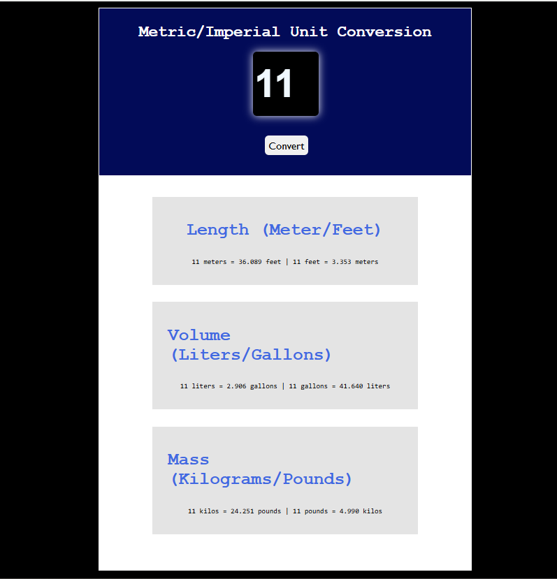

# Metric/Imperial Unit Converter

This is a simple web application that converts metric units to imperial units and vice versa. The converter handles **Length**, **Volume**, and **Mass** conversions.

## 🌐 Features

- Convert:
  - **Meters ↔ Feet**
  - **Liters ↔ Gallons**
  - **Kilograms ↔ Pounds**
- Clean and responsive UI
- Conversion results shown clearly under each section
- Fully styled using plain CSS

## 🛠️ Technologies Used

- HTML5
- CSS3
- JavaScript (vanilla)

## 📁 Project Structure
/project-folder
│
├── index.html # Main HTML file
├── style.css # Styling file
├── index.js # JavaScript logic for conversions
└── README.md # Project information and usage guide

## 🚀 How to Use

1. Clone or download the project.
2. Open `index.html` in your browser.
3. Enter a number in the input box.
4. Click **Convert**.
5. See results for Length, Volume, and Mass below.

## 📷 Screenshot

